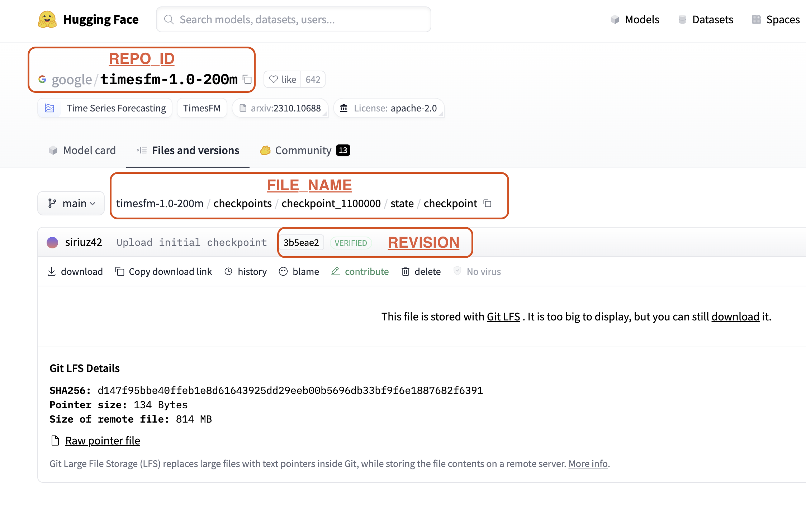

# HuggingFace Model Cache 命令行手册

## HFMC 命令行分类

HFMC 的命令行主要分为以下几个部分。

- [模型管理](#模型管理)：添加、删除、浏览本地模型文件
- [授权管理](#授权管理)：通过 auth token 在命令行登陆 HuggingFace（下载需要 ["Gated Model"](https://huggingface.co/docs/hub/en/models-gated)需要用户授权）
- [Daemon管理](#daemon-管理)：HFMC 通过 Daemon 进程在局域网分享模型文件
- [Peer管理](#peer-管理)：添加、删除、浏览其他可以共享模型文件的 HFMC 节点
- [配置管理](#配置管理)：修改、显示 HFMC 的配置参数

## 模型管理

### 参数说明

模型管理相关的命令会用到下面几个参数：

- REPO_ID：模型仓库的ID.
- REVISION：可以是 git 的 reference （例如，`main`等），也可以是 revision（例如，`ce27ec2`）
  - REVISION 的默认值是 `main`
  - 在使用 `hfmc model add` 命令下载整个模型仓库的时候，必须指定 revision（例如，`ce27ec2`）而不能使用 reference（例如，`main`等）。
- FILE_NAME：文件在仓库中的相对路径

如下图所示，上面几个参数可以从 HuggingFace 的网站得到。

### 添加、删除模型

添加整个模型仓库：

    hfmc model add -r REPO_ID [-v REVISION]

删除整个模型仓库：

    hfmc model rm -r REPO_ID [-v REVISION]

添加单个模型文件：

    hfmc model add -r REPO_ID -f FILE_NAME [-v REVISION]

删除单个模型文件：

    hfmc model rm -r REPO_ID -f FILE_NAME [-v REVISION]

### 浏览下载的模型

浏览模型仓库信息：

    hfmc model ls

浏览某个模型仓库中文件的信息：

    hfmc model ls -r REPO_ID

## 授权管理

在命令行登陆 HuggingFace：

    hfmc auth login

登出 HuggingFace:

    hfmc auth logout

## Daemon 管理

启动 Daemon:

    hfmc daemon start

查看 Daemon 状态：

    hfmc daemon status

停止 Daemon：

    hfmc daemon stop

## Peer 管理

增加 Peer：

    hfmc peer add IP [-p PORT]

删除 Peer：

    hfmc peer rm IP [-p PORT]

浏览 Peer：

    hfmc peer ls

## 配置管理

本地缓存路径配置相关命令：

    # 修改缓存路径
    hfmc conf cache set CACHE_PATH

    # 查看缓存路径
    hfmc conf cache get

    # 恢复默认缓存路径
    hfmc conf cache reset

Daemon 端口配置相关命令：

    # 修改Daemon端口
    hfmc conf port set DAEMON_PORT
    
    # 查看Daemon端口
    hfmc conf port get
    
    # 恢复默认Daemon端口
    hfmc conf port reset
