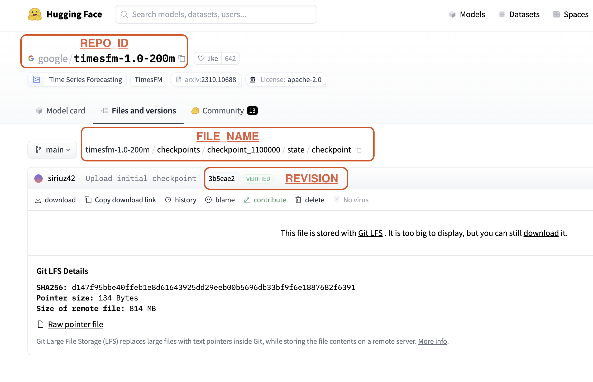

# HuggingFace Model Cache Command Line Reference

## HFMC Command Line Categories

HFMC command lines are mainly categorized as follows:

- [Model Management](#model-management): Add, delete, and browse local model files
- [Authorization Management](#authorization-management): Log in to HuggingFace via auth token on the command line (authorization is required for downloading ["Gated Models"](https://huggingface.co/docs/hub/en/models-gated))
- [Daemon Management](#daemon-management): HFMC shares model files over the local network via the Daemon process
- [Peer Management](#peer-management): Add, delete, and browse other HFMC nodes that can share model files
- [Configuration Management](#configuration-management): Modify and display HFMC configuration parameters

## Model Management

### Parameter Explanation

The following parameters are used in commands related to model management:

- REPO_ID: The ID of the model repository.
- REVISION: Can be a git reference (e.g., `main`), or a revision (e.g., `ce27ec2`)
  - The default value for REVISION is `main`
  - When using the `hfmc model add` command to download an entire model repository, a revision (e.g., `ce27ec2`) must be specified instead of a reference (e.g., `main`).
- FILE_NAME: The relative path of the file in the repository.

As shown in the image below, these parameters can be obtained from the HuggingFace website.

### Add and Delete Models

Add an entire model repository:

    hfmc model add -r REPO_ID [-v REVISION]

Delete an entire model repository:

    hfmc model rm -r REPO_ID [-v REVISION]

Add a single model file:

    hfmc model add -r REPO_ID -f FILE_NAME [-v REVISION]

Delete a single model file:

    hfmc model rm -r REPO_ID -f FILE_NAME [-v REVISION]

### Browse Downloaded Models

Browse model repository information:

    hfmc model ls

Browse files in a specific model repository:

    hfmc model ls -r REPO_ID

## Authorization Management

Log in to HuggingFace:

    hfmc auth login

Log out of HuggingFace:

    hfmc auth logout

## Daemon Management

Start the Daemon:

    hfmc daemon start

Check Daemon status:

    hfmc daemon status

Stop the Daemon:

    hfmc daemon stop

## Peer Management

Add a Peer:

    hfmc peer add IP [-p PORT]

Remove a Peer:

    hfmc peer rm IP [-p PORT]

Browse Peers:

    hfmc peer ls

## Configuration Management

Commands related to local cache path configuration:

    # Modify cache path
    hfmc conf cache set CACHE_PATH

    # View cache path
    hfmc conf cache get

    # Reset to default cache path
    hfmc conf cache reset

Commands related to Daemon port configuration:

    # Modify Daemon port
    hfmc conf port set DAEMON_PORT
    
    # View Daemon port
    hfmc conf port get
    
    # Reset to default Daemon port
    hfmc conf port reset
